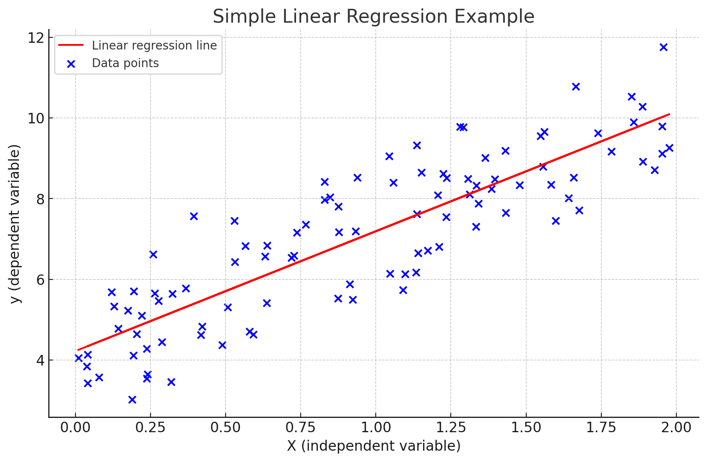

# Machine-Learning
This repository contains implementations and examples of various machine learning models. 

## Overview
This project represents my journey in learning and exploring the diverse world of machine learning. It includes practical implementations of various machine learning algorithms using Python and popular libraries like sklearn and matplotlib. The aim is to gain a deeper understanding of different algorithms and their applications in solving real-world problems.

### Features
- **Diverse Algorithm Implementations**: Examples of various machine learning algorithms.
- **Data Visualization**: Demonstrates the use of matplotlib for visualizing data and results.
- **Unit Testing**: Ensures the reliability and accuracy of the implementations.


## Table of Contents
- [Linear Regression](#linear-regression)


## Linear Regression

Linear Regression is a foundational algorithm in machine learning, used for predicting a continuous dependent variable based on one or more independent variables.

### Example
The example provided demonstrates simple linear regression where we predict a dependent variable based on a single independent variable. The code includes data generation, model training, and plotting the regression line.

- **Linear Regression Implementation**: Utilizes sklearn's LinearRegression class.
- **Data Visualization**: Scatter plot of the dataset and the fitted regression line using matplotlib.

### Visualization
Below is the graph showing the data points (in blue) and the linear regression line (in red).




### Getting Started
To run this project, clone the repository and execute the main script:

```cmd
git clone https://github.com/Ioannis-Orkos/Machine-Learning.git
cd Machine-Learning
python src\linear-regression.py
```


## More Models Coming Soon
Stay tuned for more examples and implementations of other machine learning models.

